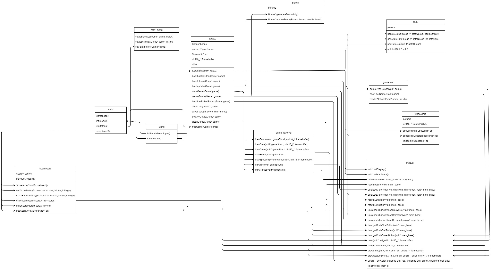
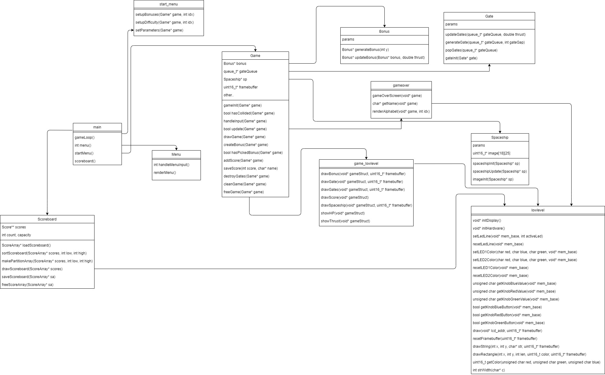

# APO Semestral project(Václav Fišer, Danil Semin)
##### Table of contents
1. [Prerequisites](#prerequisites)
2. [Installation](#installation)
3. [Compilation and execution](#compilation-and-execution)
4. [Game manual](#game-manual)  
    4.1 [Menu](#menu)  
	4.2 [Scoreboard](#scoreboard)  
	4.3 [Game parameters](#game-parameters)  
	4.4 [Game](#game)  
	4.5 [Game Over screen](#game-over-screen)  
5. [Application diagram](#application-diagram)

### Prerequisites
[MZAPO kit](https://cw.fel.cvut.cz/b202/courses/b35apo/documentation/mz_apo-howto/start)
### Installation
Project archive can be downloaded from the website page:  
https://gitlab.fel.cvut.cz/semindan/apo-semestral-project  
After that it's necessary to unzip the archive.

Alternatively, open the terminal and write the following command:
```console  
git clone https://gitlab.fel.cvut.cz/semindan/apo-semestral-project.git 
``` 

Then to open the project directory: 
```console 
cd apo-semestral-project
```

### Compilation and execution 
1. Open the terminal and get to the project's directory  
2. Local execution on MZAPO:
	```console
	make & ./spaceship
	```
3. Remote execution (link to the mzapo guide):
	```console  
	TARGET_IP=xxx.xxx.xxx.xxx make run
	```
4. Play

If you experience graphical glitches, such as only part of screen being used, you need to change defined display in *mzapo_parlcd.c* uncommenting the defines. 
```C
#define HX8357_B
#define ILI9481
```

### Game manual

##### Menu
Atfer the execution you are presented with the main menu, where you are able to navigate pushing buttons on the MZAPO's rotary switches.  
Push the blue button to start the game.  
Push the green button to view the scoreboard.  
Push the red button to close the application.  

##### Scoreboard
Player can scroll through the scoreboard using the blue knob. Pressing the red knob returns him to main menu

##### Game parameters
Before jumping into the action you are able to choose the difficulty of the game(size of gate gaps) and change the bonus spawn chance (Extra HP).  
Rotate the green switch to change the difficulty.  
Rotate the red switch to change the bonus spawn chance.  
Finally, push the blue button to start the game.

#### Game
Increase spaceship's thrust to start moving by rotating the green switch, it's possible to stop the spaceship this way, too! Current level of thrust is shown using the yellow LED bar. 
Move the spaceship up and down to avoid obstacles and collect bonuses (hearts) by rotating the blue switch. Player's hp is indicated using the left LED (green - 3, yellow - 2, red - 1). Current score is shown in the top left corner.
Player can exit the current run anytime by pushing the red button.  

##### Game over screen
After you lose or decide to exit the run you see the game over screen with you score. Achieved score is shown and game waits for green button to continue.
Advancing will move you to the next screen, where you are able to write your name down, so it later appears on the scoreboard. Rotate the blue switch to select the desired character, the selected character, that will be written, has blue color.  
To confirm your choice press the blue button. Maximum length of the name is 16 characters.  
Exit to the main menu when you are done by pushing the red button or after writing 16 characters the result is saved and you are redirected to the main menu automatically.  

### Application diagram


